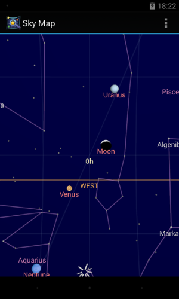
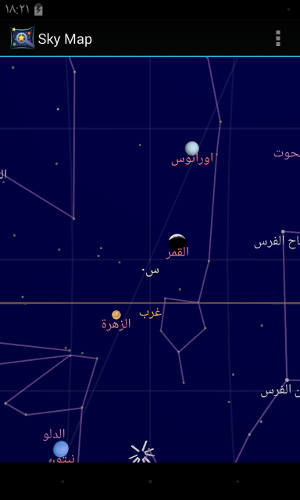

Skymap
======
 

Google Sky Map is great Android application for sky discovery. Unfortunately, the application did not get any update from years ago but Google has opened the sourcecode of the application.

### What is new?
- Apply Holo Theme.
- Manual discovery mode by default.
- Support Arabic language.

[Original Project](https://code.google.com/p/stardroid/)
